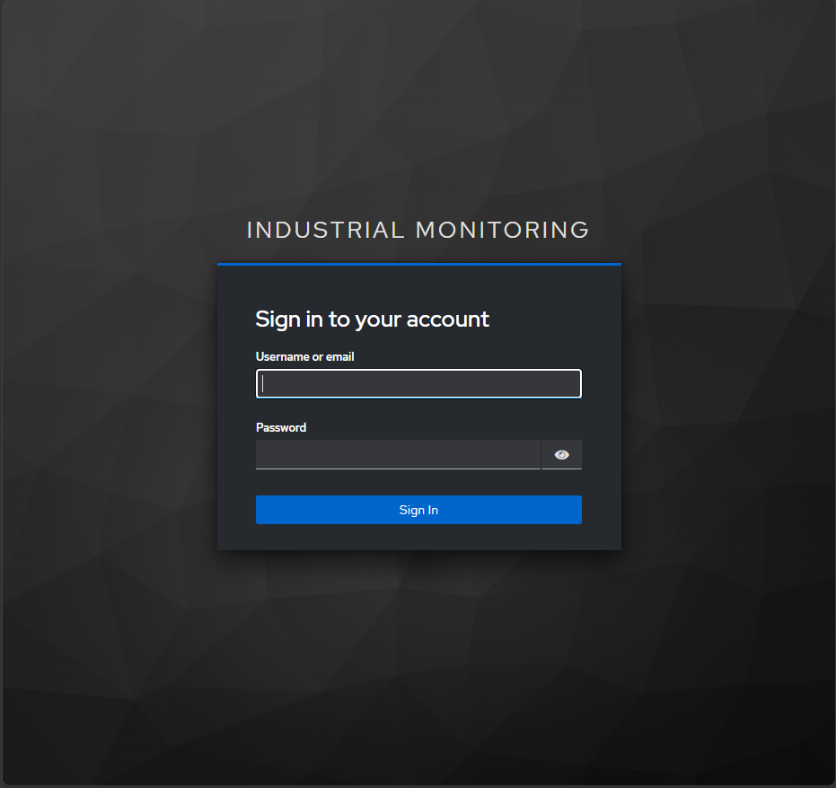

# Industrial Monitoring Platform

A full-stack monitoring platform built with Java 21, Spring Boot 3.5.15 and Angular 21.

The platform receives telemetry, event and health data from a CODESYS edge gateway through MQTT, stores the data in PostgreSQL and displays the current system state in an Angular frontend. Spring Batch creates scheduled or manually requested CSV exports that can be downloaded as ZIP archives or delivered by email.

Authentication and role-based access control are provided by Keycloak.

## Related Project

[Industrial Edge Gateway – CODESYS](https://github.com/AntonKli/industrial-edge-gateway-codesys)

---

## Overview

Industrial devices publish monitoring data through MQTT. The Spring Boot backend validates incoming messages, automatically registers devices and persists the records in PostgreSQL.

The Angular frontend provides:

* backend availability and current device status
* registered devices
* latest telemetry and health information
* recent events
* date-range export downloads
* date-range export delivery by email

Prometheus and Grafana provide operational monitoring. Spring Batch processes yearly and manually selected export periods. Completed annual exports can optionally be sent to a configured recipient through SMTP.

---

## Architecture

```text
CODESYS PLC Runtime
        |
        v
Industrial Edge Gateway
        |
      MQTT
        |
        v
Eclipse Mosquitto
        |
        v
Spring Boot Backend <------> Keycloak
        |
        +--> PostgreSQL
        |
        +--> REST API
        |       |
        |       v
        |   Angular Frontend
        |
        +--> Actuator / Prometheus
        |       |
        |       v
        |   Prometheus --> Grafana
        |
        +--> Spring Batch
                |
                v
          CSV / ZIP Export
                |
        +-------+--------+
        |                |
        v                v
   ZIP Download     SMTP Delivery
                         |
                  Mailpit or external
                    SMTP provider
```

---

## Key Features

* MQTT ingestion for telemetry, event and health messages
* Integration with a CODESYS-based industrial edge gateway
* Automatic device registration
* PostgreSQL persistence with Flyway migrations
* REST API for monitoring data
* Angular dashboard with device, telemetry, health and event views
* Keycloak login using Authorization Code Flow with PKCE
* JWT-based backend authentication
* Role-based access control for monitoring and export operations
* Scheduled yearly exports
* Manual date-range exports as ZIP archives
* Manual export delivery to a validated email address
* Optional automatic email delivery for completed yearly exports
* Reusable export preparation for download and email delivery
* Spring Batch metadata and duplicate protection
* Local SMTP testing with Mailpit
* Configurable external SMTP delivery
* OpenAPI, Actuator, Prometheus and Grafana
* Docker Compose development environment
* Automated backend tests and GitHub Actions

---

## Technology Stack

### Backend

Java 21 · Spring Boot 3.5.15 · Spring Security · OAuth2 Resource Server · Spring Batch · Spring Mail · Spring Data JPA · Hibernate · Flyway

### Frontend

Angular 21 · TypeScript · Standalone Components · Angular Signals · Angular Router · Angular HttpClient · Keycloak Angular · SCSS

### Data and Messaging

PostgreSQL 16 · MQTT · Eclipse Paho · Eclipse Mosquitto · SMTP

### Infrastructure and Monitoring

Keycloak · Mailpit · Spring Boot Actuator · Prometheus · Grafana · Docker · Docker Compose · Maven · GitHub Actions

### Testing and Documentation

JUnit 5 · Mockito · MockMvc · Testcontainers · OpenAPI 3 · Swagger UI

---

## Authentication and Roles

The Angular frontend redirects unauthenticated users to Keycloak. After login, the access token is attached to requests targeting `/api/**`.



Configured Keycloak components:

```text
Realm:            industrial-monitoring
Frontend client:  industrial-monitoring-frontend
Backend audience: industrial-monitoring-api
```

Available realm roles:

```text
VIEWER
OPERATOR
AUDITOR
ADMIN
```

Current access rules:

| Resource                                       | Required role |
| ---------------------------------------------- | ------------- |
| Devices, telemetry, health and events          | `VIEWER`      |
| Export download and email endpoints            | `OPERATOR`    |
| Health, info and Prometheus actuator endpoints | Public        |

A user with only the `VIEWER` role cannot download exports or send them by email. The backend enforces these rules independently of the Angular interface.

---

## MQTT Integration

The backend subscribes to:

```text
rtz/+/telemetry
rtz/+/events
rtz/+/health
```

Example telemetry message:

```json
{
  "v": 1,
  "ts": 123000,
  "seq": 3,
  "temp_c": 30.2,
  "rpm": 1600
}
```

Example topics:

```text
rtz/edge01/telemetry
rtz/edge01/events
rtz/edge01/health
```

---

## REST API

Monitoring endpoints:

```text
GET /api/devices
GET /api/telemetry/latest
GET /api/telemetry/paged?page=0&size=50
GET /api/telemetry/device/{deviceId}/range
GET /api/events
GET /api/health/latest
```

Export endpoints:

```text
POST /api/exports/yearly?year={year}
POST /api/exports/range?from={from}&to={to}
POST /api/exports/range/download?from={from}&to={to}
POST /api/exports/range/email
```

Example email request:

```json
{
  "fromDate": "2026-01-01",
  "toDateExclusive": "2027-01-01",
  "recipientEmail": "operator@example.com"
}
```

Example response:

```json
{
  "fromDate": "2026-01-01",
  "toDateExclusive": "2027-01-01",
  "recipientEmail": "operator@example.com",
  "status": "SENT"
}
```

Swagger UI:

```text
http://localhost:8080/swagger-ui.html
```

---

## CSV, ZIP and Email Exports

Spring Batch creates separate CSV files for:

```text
telemetry
events
health
```

Exports can cover a completed calendar year or a manually selected date range. Completed files are published only after all batch steps finish successfully.

The same prepared export is reused by both delivery paths:

```text
Export period
    |
    v
Existing completed export?
    | yes                 | no
    |                     v
    |               Run Spring Batch
    |                     |
    +----------+----------+
               |
               v
        Published CSV files
               |
       +-------+--------+
       |                |
       v                v
  ZIP download      Email with ZIP
```

### Manual export

An authorized operator can select an inclusive start and end date in the Angular frontend and choose either:

* **Download ZIP Export**
* **Send by Email**

The frontend converts the inclusive end date into the exclusive boundary expected by the backend. The backend validates the email address again before delivery.


### Scheduled yearly export

The scheduler exports the previous completed calendar year. If email delivery is enabled and the batch status is `COMPLETED`, the generated ZIP archive is sent to the configured annual recipient.

A failed SMTP delivery does not remove the already completed export. The failure is logged and the generated files remain available.

Detailed information about the batch flow, validation, configuration, error handling and idempotency is available in:

[Export Documentation](docs/export-documentation.md)

> CSV exports are application-level data archives and do not replace PostgreSQL backup and recovery procedures.

---

## Email Delivery

The application supports two SMTP modes.

### Local development with Mailpit

Mailpit captures messages locally and displays them in a browser. It does **not** forward messages to real internet mailboxes.

```text
SMTP:  mailpit:1025
Web UI: http://localhost:8025
```


### External SMTP provider

For real delivery, configure an SMTP provider through environment variables. The Java application code does not depend on a specific provider.

```properties
MAIL_HOST=smtp.example.com
MAIL_PORT=587
MAIL_USERNAME=your_smtp_login
MAIL_PASSWORD=your_smtp_secret
MAIL_SMTP_AUTH=true
MAIL_SMTP_STARTTLS_ENABLE=true

EXPORT_MAIL_ENABLED=true
EXPORT_MAIL_FROM=verified-sender@example.com
EXPORT_MAIL_ANNUAL_RECIPIENT=operator@example.com
```

The sender address must be accepted or verified by the selected SMTP provider. Secrets belong only in the local `.env` file and must never be committed.

---

## Angular Frontend

### Dashboard

The dashboard displays backend availability, registered-device count, current temperature, motor speed and device diagnostics.


### Devices, events and exports

The devices page displays registered devices, recent events and the export form. Operators can download the selected period or send it to an email address.


The screenshots use data generated by the CODESYS and MQTT test setup.

---

## Operational Monitoring

Public actuator endpoints:

```text
GET /actuator/health
GET /actuator/info
GET /actuator/prometheus
```

Additional metrics are available through:

```text
GET /actuator/metrics
```

Custom ingestion metrics:

```text
industrial_telemetry_records_saved_total
industrial_event_records_saved_total
industrial_health_records_saved_total
```

### Grafana Dashboard


---

## Running the Project

### Requirements

* Docker Desktop or Docker Engine
* Docker Compose
* Node.js and npm
* Git

### 1. Configure the environment

Windows PowerShell:

```powershell
Copy-Item .env.example .env
```

Linux or macOS:

```bash
cp .env.example .env
```

The local `.env` provides credentials and environment-specific configuration. Keep SMTP passwords, API keys and other secrets out of Git.

### 2. Start the backend stack

```bash
docker compose up --build -d
```

Services:

```text
Backend API:  http://localhost:8080
Swagger UI:   http://localhost:8080/swagger-ui.html
Keycloak:     http://localhost:8180
Mailpit:      http://localhost:8025
Prometheus:   http://localhost:19090
Grafana:      http://localhost:13000
Mosquitto:    localhost:1884
PostgreSQL:   localhost:5432
```

### 3. Start the Angular frontend

```bash
cd frontend/angular-monitoring-frontend
npm install
npm start
```

Open:

```text
http://localhost:4200
```

The Angular development proxy forwards `/api/**` and `/actuator/**` requests to the backend.

The frontend runs separately from the Docker Compose stack.

### Stop the stack

```bash
docker compose down
```

---

## Testing and Build Verification

### Backend

Windows:

```powershell
cd backend
.\mvnw.cmd clean test
```

Linux or macOS:

```bash
cd backend
./mvnw clean test
```

The test suite covers export preparation, ZIP generation, email delivery, request validation, role-based authorization and the scheduled annual delivery flow.

### Frontend

```bash
cd frontend/angular-monitoring-frontend
npm run build
```

GitHub Actions runs the Maven test suite for pushes and pull requests targeting `main`.

---

## Database Migrations

Flyway manages the database schema:

```text
V1  Application tables
    - devices
    - telemetry_records
    - events
    - health_records

V2  Spring Batch metadata tables and sequences
```

Hibernate validates the Flyway-managed schema.

---

## Project Structure

```text
industrial-monitoring-backend/
├── backend/
│   ├── src/main/java/com/example/industrialmonitoring/
│   ├── src/main/resources/db/migration/
│   ├── src/test/
│   ├── Dockerfile
│   └── pom.xml
├── frontend/
│   └── angular-monitoring-frontend/
├── docker/
│   ├── keycloak/
│   │   └── industrial-monitoring-realm.json
│   └── mosquitto/
├── monitoring/
│   └── prometheus/
├── docs/
│   ├── export-documentation.md
│   └── images/
├── .env.example
├── docker-compose.yml
└── README.md
```
