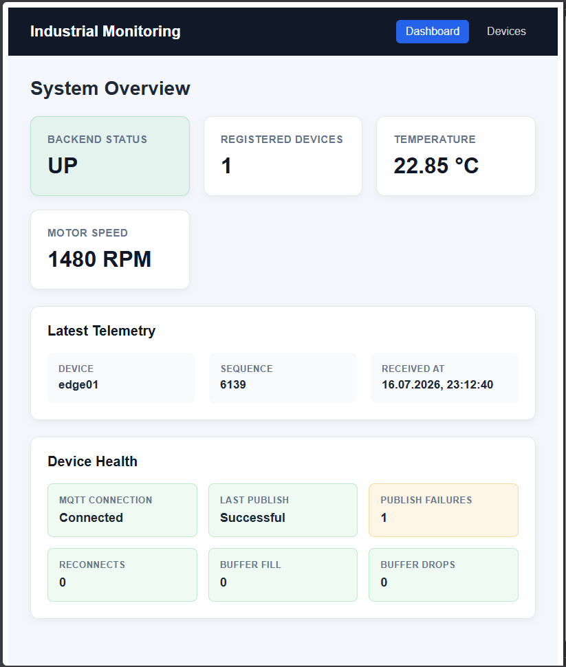
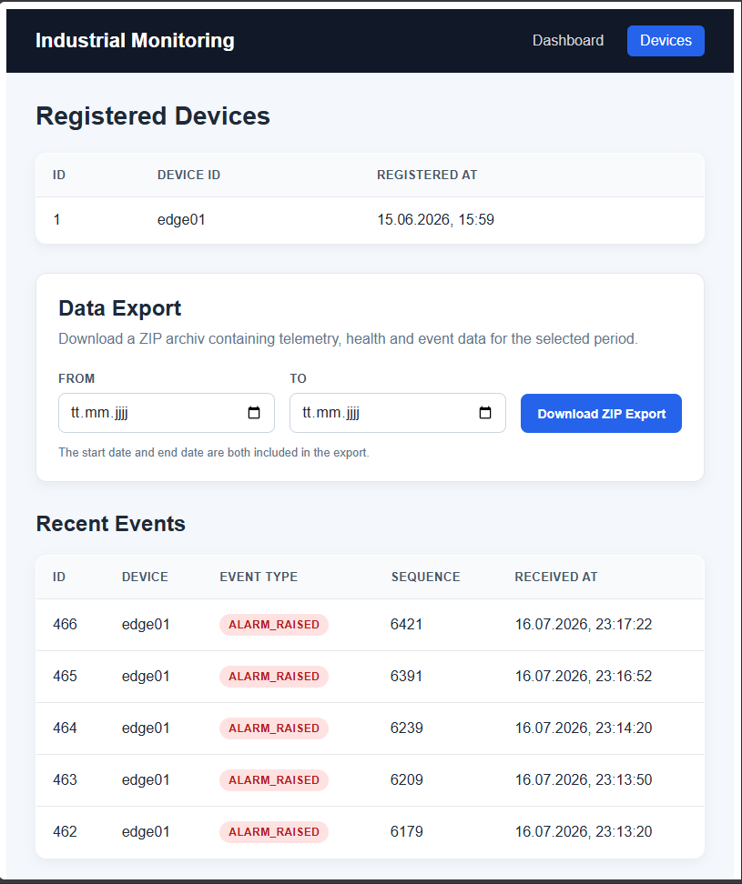
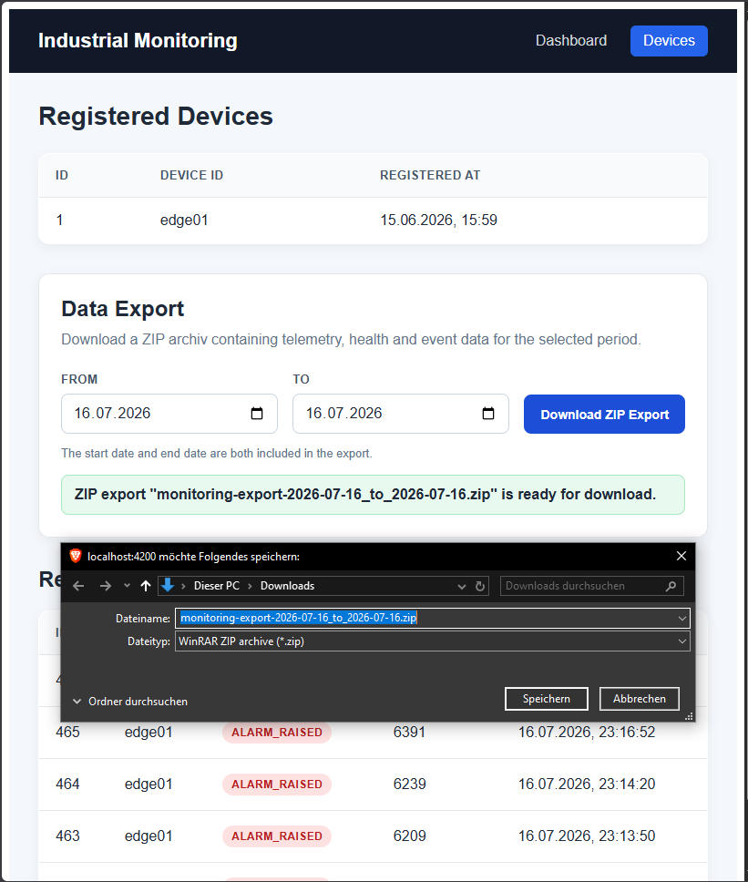
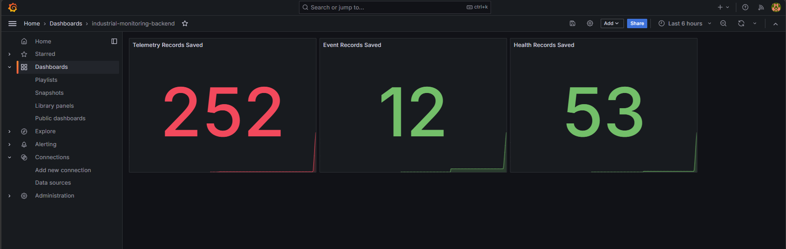

# Industrial Monitoring Platform

A full-stack monitoring platform built with Java 21, Spring Boot 3.5.15 and Angular 21. It receives telemetry, event and health data from a CODESYS edge gateway through MQTT, stores the data in PostgreSQL, visualizes the current system state, exposes REST and monitoring endpoints, and creates scheduled or on-demand CSV exports with Spring Batch.

## Related Project

[Industrial Edge Gateway – CODESYS](https://github.com/AntonKli/industrial-edge-gateway-codesys)

---

## Overview

Industrial devices publish telemetry, event and health messages through MQTT. The Spring Boot backend validates the messages, automatically registers devices and persists the received data in PostgreSQL.

The Angular frontend consumes the REST API and displays backend availability, current telemetry, device diagnostics, registered devices and recent events. Users can select complete calendar days and download telemetry, health and event data as a ZIP archive containing three CSV files.

Prometheus and Grafana provide operational monitoring, while Spring Batch handles scheduled yearly exports and manually selected date ranges.

---

## Architecture

```text
CODESYS PLC Runtime
        |
        v
Industrial Edge Gateway
        |
        | MQTT
        v
Eclipse Mosquitto
        |
        v
Spring Boot Backend
        |
        +--------------------> PostgreSQL
        |
        +--------------------> REST API ----------------> Angular Frontend
        |
        +--------------------> OpenAPI / Swagger UI
        |
        +--------------------> Actuator / Prometheus Metrics
                                    |
                                    v
                               Prometheus
                                    |
                                    v
                                 Grafana
        |
        +--------------------> Spring Batch -----------> CSV / ZIP Export
```

---

## Key Features

- MQTT ingestion for telemetry, event and health messages
- Integration with a CODESYS-based industrial edge gateway
- Automatic device registration and PostgreSQL persistence
- REST endpoints for devices, telemetry, events and health data
- Angular dashboard with current backend status, telemetry and device-health information
- Registered-device and recent-event views
- Browser download of ZIP archives containing three CSV files
- Scheduled yearly and manual date-range exports with Spring Batch
- Chunk-based processing, persistent batch metadata and duplicate protection
- Staging-to-publication workflow that exposes only completed exports
- OpenAPI documentation, Actuator, Prometheus and Grafana
- Docker Compose development environment
- Automated backend tests and GitHub Actions continuous integration

---

## Technology Stack

### Backend

Java 21 · Spring Boot 3.5.15 · Spring Batch · Spring Data JPA · Hibernate · Flyway

### Frontend

Angular 21 · TypeScript · Standalone Components · Angular Signals · Angular Router · Angular HttpClient · SCSS

### Data and Messaging

PostgreSQL 16 · MQTT · Eclipse Paho · Eclipse Mosquitto

### Monitoring and Infrastructure

Spring Boot Actuator · Prometheus · Grafana · Docker · Docker Compose · Maven · GitHub Actions

### Testing and Documentation

JUnit 5 · Mockito · MockMvc · Testcontainers · OpenAPI 3 · Swagger UI

---

## MQTT Integration

The backend subscribes to these topic patterns:

```text
rtz/+/telemetry
rtz/+/events
rtz/+/health
```

Example telemetry message:

```json
{
  "v": 1,
  "ts": 123000,
  "seq": 3,
  "temp_c": 30.2,
  "rpm": 1600
}
```

Example device topics:

```text
rtz/edge01/telemetry
rtz/edge01/events
rtz/edge01/health
```

---

## REST API

```text
GET  /api/devices
GET  /api/telemetry/latest
GET  /api/telemetry/paged?page=0&size=50
GET  /api/telemetry/device/{deviceId}/range
GET  /api/events
GET  /api/health/latest

POST /api/exports/yearly?year={year}
POST /api/exports/range?from={from}&to={to}
POST /api/exports/range/download?from={from}&to={to}
```

Complete endpoint documentation is available through Swagger UI at:

```text
http://localhost:8080/swagger-ui.html
```

---

## CSV and ZIP Exports

Spring Batch creates separate CSV files for telemetry, events and health records. Exports can cover a completed calendar year or a manually selected date range.

The processing flow uses configurable chunks and writes files to a staging directory first. An export is published only after every batch step completes successfully. The browser download endpoint then streams the completed CSV files as a ZIP archive.

The backend uses an exclusive end date. The Angular frontend presents both selected days as inclusive and internally sends the following calendar day as the backend end date.

For batch flow, validation rules, error responses, configuration, idempotency and API examples, see the [detailed export documentation](docs/export-documentation.md).

> CSV exports are application-level data archives. They do not replace physical PostgreSQL backup and recovery procedures.

---

## Angular Monitoring Frontend

The standalone Angular application provides a user-oriented view of the monitoring data exposed by the backend.

### Dashboard

The dashboard displays backend availability, registered-device count, latest temperature and motor speed, telemetry metadata and device diagnostics.



### Devices and Events

The devices page displays registered devices, a date-range export form and the five most recent monitoring events.



### ZIP Export Download

The selected period is downloaded as one ZIP archive containing telemetry, health and event CSV files.



The screenshots use data generated by the CODESYS and MQTT test setup.

---

## Operational Monitoring

The backend exposes health information and custom ingestion metrics through Spring Boot Actuator and Prometheus.

```text
GET /actuator/health
GET /actuator/info
GET /actuator/metrics
GET /actuator/prometheus
```

Custom metrics:

```text
industrial_telemetry_records_saved_total
industrial_event_records_saved_total
industrial_health_records_saved_total
```

### Grafana Dashboard



---

## Running the Project

### Requirements

- Docker Desktop or Docker Engine
- Docker Compose
- Node.js and npm
- Git

### 1. Configure the Environment

#### Windows PowerShell

```powershell
Copy-Item .env.example .env
```

#### Linux or macOS

```bash
cp .env.example .env
```

Replace the placeholder credentials in `.env`. The file is excluded from Git.

### 2. Start the Backend Stack

```bash
docker compose up --build -d
```

Services:

```text
Backend API:  http://localhost:8080
Swagger UI:   http://localhost:8080/swagger-ui.html
Prometheus:   http://localhost:19090
Grafana:      http://localhost:13000
Mosquitto:    localhost:1884
PostgreSQL:   localhost:5432
```

### 3. Start the Angular Frontend

```bash
cd frontend/angular-monitoring-frontend
npm install
npm start
```

Open:

```text
http://localhost:4200
```

The development proxy forwards `/api/**` and `/actuator/**` requests to the backend on port `8080`. The Angular frontend is currently started separately and is not part of the Docker Compose stack.

### Stop the Backend Stack

```bash
docker compose down
```

---

## Testing and Build Verification

### Backend

#### Windows

```powershell
cd backend
.\mvnw.cmd clean test
```

#### Linux or macOS

```bash
cd backend
./mvnw clean test
```

The test suite covers application startup, Flyway migrations, repositories, ingestion services, REST controllers, export validation, file handling, scheduling and duplicate protection.

### Frontend

```bash
cd frontend/angular-monitoring-frontend
npm run build
```

GitHub Actions runs the Maven test suite for pushes and pull requests targeting `main`.

---

## Database Migrations

Flyway manages the database schema:

```text
V1  Application tables
    - devices
    - telemetry_records
    - events
    - health_records

V2  Spring Batch metadata tables and sequences
```

Hibernate validates the Flyway-managed schema and does not create or update tables automatically.

---

## Project Structure

```text
industrial-monitoring-backend/
├── backend/
│   ├── src/main/java/com/example/industrialmonitoring/
│   ├── src/main/resources/db/migration/
│   ├── src/test/
│   ├── Dockerfile
│   └── pom.xml
├── frontend/
│   └── angular-monitoring-frontend/
├── docker/
│   └── mosquitto/
├── monitoring/
│   └── prometheus/
├── docs/
│   ├── export-documentation.md
│   └── images/
│       ├── angular-dashboard.png
│       ├── angular-devices.png
│       ├── angular-export-download.png
│       └── grafana-dashboard.png
├── .env.example
├── docker-compose.yml
└── README.md
```
