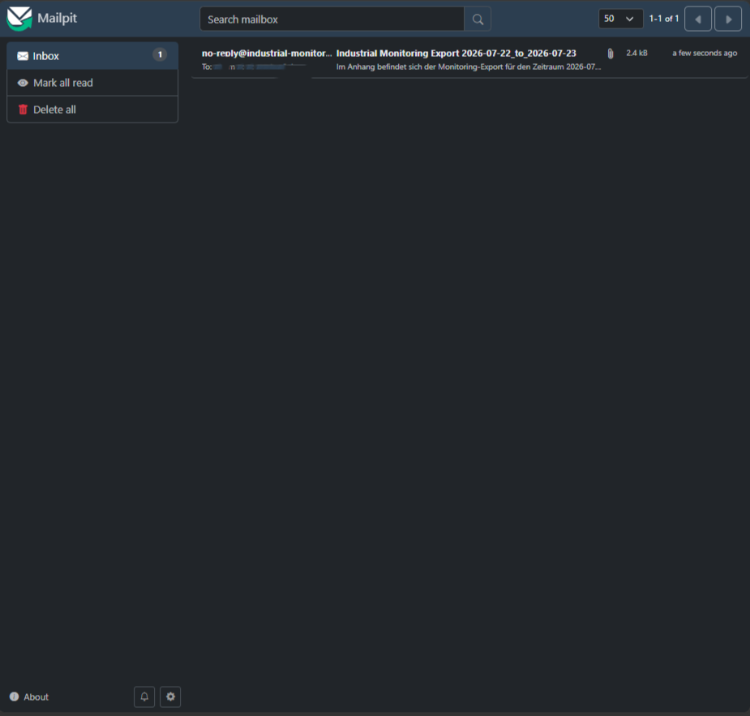

# Export Documentation

This document describes the CSV, ZIP and email export workflow of the Industrial Monitoring Platform.

The export feature creates application-level archives of persisted telemetry, event and health records. Exports can cover a completed calendar year or a manually selected date range. Completed data can be downloaded as a ZIP archive or delivered as an email attachment.

> The exported CSV files are application-level data archives. They do not replace PostgreSQL backup, restore or disaster-recovery procedures.

---

## Feature Overview

The platform supports four export entry points:

| Entry point | Trigger | Result |
| --- | --- | --- |
| Scheduled yearly export | Spring scheduler | CSV export for the previous completed calendar year |
| Manual yearly export | REST API | CSV export for a completed calendar year |
| Manual range download | Angular frontend or REST API | ZIP archive containing three CSV files |
| Manual range email | Angular frontend or REST API | Email containing the ZIP archive as an attachment |

The scheduled yearly flow can additionally send the completed archive to a configured recipient when export email delivery is enabled.

```text
Selected export period
        |
        v
Existing completed export?
   | yes                | no
   |                    v
   |              Start Spring Batch
   |                    |
   |              Require COMPLETED
   |                    |
   +---------+----------+
             |
             v
      Published CSV files
             |
      +------+-------+
      |              |
      v              v
 ZIP download    Email attachment
```

---

## Main Components

### `ExportPeriod`

`ExportPeriod` represents the selected time range and contains:

```text
fromDate

toDateExclusive

zoneId
```

It provides the timestamp boundaries used by the database readers as well as separate keys for storage directories and user-facing filenames.

### `ExportJobService`

Starts the Spring Batch job for yearly and flexible date-range exports. It validates the requested year or range and translates duplicate or non-restartable executions into an export conflict.

### `ExportFileService`

Manages:

* staging directories
* final export directories
* telemetry, event and health CSV paths
* publication of completed exports
* ZIP creation from published CSV files

### `ExportPreparationService`

Provides the shared preparation flow used by download and email delivery:

1. Create the `ExportPeriod`.
2. Check whether the final export directory already exists.
3. Reuse the completed export when available.
4. Otherwise start the range export.
5. Require `BatchStatus.COMPLETED`.
6. Verify that the final directory was published.
7. Return the prepared period.

This avoids duplicating batch-start and publication checks in the controller.

### `ExportMailService`

Creates an email for an already prepared export:

1. Validate that email delivery is enabled.
2. Validate that the recipient is present.
3. Create a temporary ZIP file.
4. Stream the published CSV files into the ZIP.
5. Create a MIME message.
6. Attach the ZIP file.
7. Send the message through `JavaMailSender`.
8. Delete the temporary ZIP in a `finally` block.

The service does not start a batch job. Export preparation remains the responsibility of `ExportPreparationService` or the scheduler.

### `ExportScheduler`

Calculates the previous calendar year in the configured export time zone, starts the yearly batch job and optionally sends the completed export to `EXPORT_MAIL_ANNUAL_RECIPIENT`.

Email delivery is attempted only when:

* the batch execution status is `COMPLETED`
* `EXPORT_MAIL_ENABLED` is `true`
* an annual recipient is configured

An SMTP failure does not remove or invalidate the completed export.

### `ExportController`

Exposes the yearly, range, ZIP-download and email-delivery endpoints under:

```text
/api/exports/**
```

### Angular export form

The Devices page lets an authorized operator:

* choose an inclusive start date
* choose an inclusive end date
* download the export as ZIP
* enter a recipient address and send the export by email


---

## Authentication and Authorization

All export endpoints require a valid Keycloak access token and the `OPERATOR` realm role.

```text
/api/exports/** -> ROLE_OPERATOR
```

Expected behavior:

| Request | Result |
| --- | --- |
| No bearer token | `401 Unauthorized` |
| Valid token with only `VIEWER` | `403 Forbidden` |
| Valid token with `OPERATOR` | Export action allowed |

A user with only the `VIEWER` role can read monitoring data but cannot download archives or send them to an email address.

The Angular interface improves usability by presenting export controls only to suitable users, but the backend authorization rule is the security boundary.

---

## Date Model

### Half-open backend interval

The backend uses a half-open interval:

```text
createdAt >= fromDate at start of day
createdAt <  toDateExclusive at start of day
```

Example:

```text
fromDate:        2026-07-22

toDateExclusive: 2026-07-24
```

The selected records cover both July 22 and July 23. July 24 is not included.

Using an exclusive upper boundary avoids artificial values such as `23:59:59.999999` and works cleanly with database range queries.

### Inclusive Angular end date

The Angular form presents both selected dates as inclusive. Before calling the backend, it adds one calendar day to the selected end date.

```text
UI selection: 2026-07-22 through 2026-07-23
API period:   2026-07-22 through 2026-07-24 exclusive
```

### Validation rules

Valid date ranges must meet these conditions:

* `fromDate` must not be null
* `toDateExclusive` must not be null
* `fromDate` must be before `toDateExclusive`
* the start must not be earlier than the supported minimum year
* the range must not extend beyond the permitted current-day boundary

The yearly endpoint is intended for completed calendar years. Current-year data can be exported through the flexible range endpoints.

---

## Export Keys and Filenames

The implementation distinguishes between an internal directory key and a user-facing filename key.

### Full calendar year

A complete year uses the compact year key everywhere:

```text
Period:        2025-01-01 through 2026-01-01 exclusive
Directory:     exports/2025/
CSV files:     telemetry-export-2025.csv
               events-export-2025.csv
               health-export-2025.csv
ZIP file:      monitoring-export-2025.zip
```

### Flexible range

For a flexible range, internal directories use the exclusive boundary while CSV and ZIP filenames use the inclusive end date.

```text
UI period:          2025-10-01 through 2026-03-31 inclusive
Backend period:     2025-10-01 through 2026-04-01 exclusive
Directory key:      2025-10-01_to_2026-04-01
Filename key:       2025-10-01_to_2026-03-31
```

Result:

```text
exports/
└── 2025-10-01_to_2026-04-01/
    ├── telemetry-export-2025-10-01_to_2026-03-31.csv
    ├── events-export-2025-10-01_to_2026-03-31.csv
    └── health-export-2025-10-01_to_2026-03-31.csv
```

The downloaded or emailed archive is named:

```text
monitoring-export-2025-10-01_to_2026-03-31.zip
```

This separation preserves unambiguous backend interval semantics while presenting the period in the inclusive form expected by users.

---

## Spring Batch Flow

The export job uses the same processing flow for yearly and flexible ranges.

```text
prepareAnnualExportStep
        |
        v
telemetryExportStep
        |
        v
eventExportStep
        |
        v
healthExportStep
        |
        v
finalizeAnnualExportStep
```

### `prepareAnnualExportStep`

Creates the staging directory for the selected export period.

### `telemetryExportStep`

Reads telemetry records from PostgreSQL in configurable chunks and writes them to a CSV file.

### `eventExportStep`

Reads event records from PostgreSQL in configurable chunks and writes them to a CSV file.

### `healthExportStep`

Reads health records from PostgreSQL in configurable chunks and writes them to a CSV file.

### `finalizeAnnualExportStep`

Publishes the staging directory only after every previous step has completed successfully.

---

## Staging and Publication

Files are written to `.staging` first.

```text
exports/
└── .staging/
    └── 2025-10-01_to_2026-04-01/
        ├── telemetry-export-2025-10-01_to_2026-03-31.csv
        ├── events-export-2025-10-01_to_2026-03-31.csv
        └── health-export-2025-10-01_to_2026-03-31.csv
```

After all processing steps succeed, the staging directory is moved to its final location:

```text
exports/
└── 2025-10-01_to_2026-04-01/
    ├── telemetry-export-2025-10-01_to_2026-03-31.csv
    ├── events-export-2025-10-01_to_2026-03-31.csv
    └── health-export-2025-10-01_to_2026-03-31.csv
```

Consequences:

* incomplete exports are not exposed as completed archives
* download and email delivery read only from final directories
* an already published export can be reused without another batch execution
* SMTP failures do not damage the CSV export

The generated `exports/` directory is excluded from Git.

---

## Chunk-Based Processing

Records are read and written in configurable chunks instead of loading the complete period into memory.

```properties
EXPORT_CHUNK_SIZE=100
```

The chunk size defines the number of records processed per transaction. It can be adjusted according to data volume, database performance and available memory.

---

## Spring Batch Metadata and Idempotency

Spring Batch stores job, execution and step metadata in PostgreSQL. Flyway migration `V2` creates the required metadata tables and sequences.

The export period forms the logical identity of a range execution. The identifying values are based on:

```text
fromDate

toDateExclusive

zoneId
```

Starting an already running, completed or non-restartable job instance is translated into an export conflict where applicable.

The download and email endpoints also check the final export directory first. A previously published period is reused directly instead of starting a duplicate export.

A partial current-year range does not block a later complete yearly export because the periods differ.

---

## REST Endpoints

All examples assume a valid `OPERATOR` access token.

```text
Authorization: Bearer <access-token>
```

### Start a completed yearly export

```http
POST /api/exports/yearly?year=2025
```

PowerShell:

```powershell
Invoke-RestMethod `
  -Method Post `
  -Headers @{ Authorization = "Bearer $accessToken" } `
  -Uri "http://localhost:8080/api/exports/yearly?year=2025"
```

Example response:

```json
{
  "executionId": 1,
  "jobName": "annualMonitoringExportJob",
  "year": 2025,
  "status": "COMPLETED"
}
```

### Start a flexible range export

The `to` query parameter is exclusive.

```http
POST /api/exports/range?from=2025-10-01&to=2026-04-01
```

PowerShell:

```powershell
Invoke-RestMethod `
  -Method Post `
  -Headers @{ Authorization = "Bearer $accessToken" } `
  -Uri "http://localhost:8080/api/exports/range?from=2025-10-01&to=2026-04-01"
```

Example response:

```json
{
  "executionId": 2,
  "jobName": "annualMonitoringExportJob",
  "fromDate": "2025-10-01",
  "toDateExclusive": "2026-04-01",
  "status": "COMPLETED"
}
```

### Download a range as ZIP

```http
POST /api/exports/range/download?from=2025-10-01&to=2026-04-01
```

PowerShell:

```powershell
Invoke-WebRequest `
  -Method Post `
  -Headers @{ Authorization = "Bearer $accessToken" } `
  -Uri "http://localhost:8080/api/exports/range/download?from=2025-10-01&to=2026-04-01" `
  -OutFile "monitoring-export.zip"
```

Successful response:

```text
Status:              200 OK
Content-Type:        application/zip
Content-Disposition: attachment; filename="monitoring-export-2025-10-01_to_2026-03-31.zip"
```

The endpoint prepares or reuses the export and streams the three final CSV files into one ZIP archive.

### Send a range by email

```http
POST /api/exports/range/email
Content-Type: application/json
```

Request:

```json
{
  "fromDate": "2025-10-01",
  "toDateExclusive": "2026-04-01",
  "recipientEmail": "operator@example.com"
}
```

PowerShell:

```powershell
$body = @{
  fromDate = "2025-10-01"
  toDateExclusive = "2026-04-01"
  recipientEmail = "operator@example.com"
} | ConvertTo-Json

Invoke-RestMethod `
  -Method Post `
  -Headers @{ Authorization = "Bearer $accessToken" } `
  -ContentType "application/json" `
  -Body $body `
  -Uri "http://localhost:8080/api/exports/range/email"
```

Example response:

```json
{
  "fromDate": "2025-10-01",
  "toDateExclusive": "2026-04-01",
  "recipientEmail": "operator@example.com",
  "status": "SENT"
}
```

The recipient is part of the JSON body rather than the URL. The backend validates the address independently of the Angular form.

---

## Email Delivery

### Message content

The email contains:

* the configured sender address
* the requested recipient address
* a subject containing the export filename key
* a short text describing the inclusive export period
* one ZIP attachment containing telemetry, event and health CSV files

### Temporary ZIP lifecycle

The ZIP attachment is written to a temporary file so that larger exports do not need to be held completely in memory.

The temporary file is deleted after successful delivery and also after delivery errors. A cleanup failure is logged without hiding the primary delivery result.

### Local development with Mailpit

Mailpit receives SMTP messages locally and exposes them in a browser.

```text
SMTP host: mailpit
SMTP port: 1025
Web UI:    http://localhost:8025
```

Mailpit does not forward messages to public internet mailboxes. A real-looking recipient address appears only inside the local Mailpit inbox.



Example local configuration:

```properties
MAIL_HOST=mailpit
MAIL_PORT=1025
MAIL_USERNAME=
MAIL_PASSWORD=
MAIL_SMTP_AUTH=false
MAIL_SMTP_STARTTLS_ENABLE=false

EXPORT_MAIL_ENABLED=true
EXPORT_MAIL_FROM=no-reply@industrial-monitoring.local
EXPORT_MAIL_ANNUAL_RECIPIENT=operator@example.com
```

### External SMTP provider

A real SMTP relay can be selected without changing the Java implementation.

```properties
MAIL_HOST=smtp.example.com
MAIL_PORT=587
MAIL_USERNAME=your_smtp_login
MAIL_PASSWORD=your_smtp_secret
MAIL_SMTP_AUTH=true
MAIL_SMTP_STARTTLS_ENABLE=true

EXPORT_MAIL_ENABLED=true
EXPORT_MAIL_FROM=verified-sender@example.com
EXPORT_MAIL_ANNUAL_RECIPIENT=operator@example.com
```

Requirements depend on the provider, but commonly include:

* a dedicated SMTP login
* an SMTP key or password
* authenticated SMTP
* STARTTLS
* a verified or accepted sender address

SMTP credentials belong only in the local `.env` or a deployment secret store. They must never be committed.

### Docker Compose selection

The backend environment uses variable-based SMTP values with a Mailpit fallback.

```yaml
MAIL_HOST: ${MAIL_HOST:-mailpit}
MAIL_PORT: "${MAIL_PORT:-1025}"
MAIL_USERNAME: ${MAIL_USERNAME:-}
MAIL_PASSWORD: ${MAIL_PASSWORD:-}
MAIL_SMTP_AUTH: "${MAIL_SMTP_AUTH:-false}"
MAIL_SMTP_STARTTLS_ENABLE: "${MAIL_SMTP_STARTTLS_ENABLE:-false}"
```

Changing `.env` values requires recreating the backend container:

```powershell
docker compose up -d --force-recreate backend
```

A new image build is needed only when application code, dependencies or the Dockerfile changed.

---

## Scheduled Annual Delivery

The scheduler runs according to `EXPORT_CRON` and `EXPORT_ZONE`.

Default schedule:

```text
0 0 2 1 1 *
```

Meaning:

```text
Second:       0
Minute:       0
Hour:         2
Day of month: 1
Month:        January
Day of week:  any
```

At the default schedule, the application exports the previous completed calendar year.

Example:

```text
Scheduler execution: 2027-01-01 at 02:00 Europe/Berlin
Export period:        2026-01-01 through 2027-01-01 exclusive
Filename key:         2026
```

After the batch job returns `COMPLETED`, the scheduler checks the mail settings:

```text
EXPORT_MAIL_ENABLED=true
EXPORT_MAIL_ANNUAL_RECIPIENT=operator@example.com
```

If delivery is disabled or no annual recipient is configured, the CSV export remains completed and only the email step is skipped.

If SMTP delivery fails, the failure is logged and the published export remains available for later download or another delivery attempt.

---

## Configuration Reference

### Export processing

| Variable | Application default | Description |
| --- | --- | --- |
| `EXPORT_ENABLED` | `true` | Enables the scheduled yearly export component |
| `EXPORT_OUTPUT_DIR` | `exports` | Base directory for staging and final exports |
| `EXPORT_CHUNK_SIZE` | `100` | Records processed per Spring Batch transaction |
| `EXPORT_CRON` | `0 0 2 1 1 *` | Scheduler cron expression |
| `EXPORT_ZONE` | `Europe/Berlin` | Time zone for period boundaries and scheduling |

Docker Compose normally maps the application directory to the project:

```yaml
volumes:
  - ./exports:/app/exports
```

Typical container value:

```properties
EXPORT_OUTPUT_DIR=/app/exports
```

### Export email behavior

| Variable | Application default | Description |
| --- | --- | --- |
| `EXPORT_MAIL_ENABLED` | `false` | Enables email delivery in `ExportMailService` and the scheduler |
| `EXPORT_MAIL_FROM` | `no-reply@industrial-monitoring.local` | Sender address used in MIME messages |
| `EXPORT_MAIL_ANNUAL_RECIPIENT` | empty | Recipient for scheduled yearly delivery |

### SMTP connection

| Variable | Local default | Description |
| --- | --- | --- |
| `MAIL_HOST` | `localhost` in Spring / `mailpit` in Compose fallback | SMTP host |
| `MAIL_PORT` | `1025` | SMTP port |
| `MAIL_USERNAME` | empty | SMTP login |
| `MAIL_PASSWORD` | empty | SMTP secret |
| `MAIL_SMTP_AUTH` | `false` | Enables SMTP authentication |
| `MAIL_SMTP_STARTTLS_ENABLE` | `false` | Enables STARTTLS |

The application configures SMTP connection, read and write timeouts so a failing mail server does not block indefinitely.

---

## Validation and Error Handling

### Invalid export year

A year outside the supported range returns `400 Bad Request`.

Example:

```json
{
  "type": "about:blank",
  "title": "Invalid export year",
  "status": 400,
  "detail": "Export year must be between 2000 and the most recently permitted year",
  "instance": "/api/exports/yearly"
}
```

### Invalid export period

An empty, reversed, too-early or excessively future-dated range returns `400 Bad Request`.

```json
{
  "type": "about:blank",
  "title": "Invalid export period",
  "status": 400,
  "detail": "Export start date must be before the exclusive end date",
  "instance": "/api/exports/range"
}
```

### Invalid recipient address

`ExportEmailRequest` requires:

```text
fromDate        -> not null

toDateExclusive -> not null

recipientEmail  -> not blank and valid email syntax
```

Invalid JSON request data is rejected before export preparation or mail delivery begins.

### Export conflict

A running, completed or non-restartable job instance can return `409 Conflict`.

```json
{
  "type": "about:blank",
  "title": "Export conflict",
  "status": 409,
  "detail": "Export for the requested period is already running, completed or cannot currently be restarted",
  "instance": "/api/exports/yearly"
}
```

### Missing published files

Download and email delivery require a final export directory containing CSV files. Missing directories or empty final directories cause the operation to fail rather than returning an empty archive.

### SMTP failure

Manual delivery returns a server error when the SMTP connection, authentication or send operation fails. The Angular frontend shows:

```text
The export could not be sent by email.
```

The completed CSV export remains available.

For scheduled delivery, the error is logged and the scheduler invocation finishes without deleting the export.

---

## Security Considerations

* Export access is restricted to `OPERATOR` in the backend.
* A `VIEWER` cannot download or send exports.
* The recipient address is sent in a JSON body instead of a query string.
* Backend validation is required even though Angular performs its own validation.
* SMTP passwords and keys must remain outside Git.
* `.env` is excluded through `.gitignore`.
* `EXPORT_MAIL_FROM` must use an address accepted by the configured SMTP provider.
* SMTP error logs must not expose passwords or keys.
* Email delivery can move monitoring data outside the platform and therefore requires the same export authorization as ZIP download.

---

## Testing

The backend test suite covers the main export and delivery paths.

### Export period and file tests

* yearly and flexible period calculation
* inclusive and exclusive date handling
* directory and filename keys
* telemetry, event and health CSV paths
* ZIP creation
* CSV escaping
* spreadsheet-formula protection

### `ExportPreparationServiceTest`

* reuses an existing final export without starting another job
* starts a range job when no completed export exists
* requires a completed execution and a published directory

### `ExportMailServiceTest`

* creates and sends a MIME message
* uses the configured sender
* uses the requested recipient
* creates the expected subject
* attaches a generated ZIP file
* rejects disabled delivery
* rejects a blank recipient

### Controller tests

* sends a prepared range export by email
* returns `SENT` after successful delivery
* rejects an invalid email address before invoking export services
* preserves ISO date serialization in the response

### Authorization tests

* rejects requests without a token
* forbids email export for `VIEWER`
* allows email export for `OPERATOR`
* avoids invoking export services after authorization failure

### Scheduler tests

* calculates the previous year in the configured time zone
* starts the annual export
* handles job-start failures without crashing the scheduler
* sends only a completed annual export
* uses the configured annual recipient

Run the complete backend suite:

```powershell
cd backend
.\mvnw.cmd clean test
```

Run selected tests:

```powershell
.\mvnw.cmd -Dtest=ExportPreparationServiceTest test
.\mvnw.cmd -Dtest=ExportMailServiceTest test
.\mvnw.cmd -Dtest=ExportControllerTest test
.\mvnw.cmd -Dtest=ExportAuthorizationTest test
.\mvnw.cmd -Dtest=ExportSchedulerTest test
```

Frontend production build:

```powershell
cd frontend/angular-monitoring-frontend
npm run build
```

---

## Troubleshooting

### Download works but email delivery fails

This usually means that export preparation and ZIP creation succeeded while the SMTP connection failed.

Check the active container configuration without printing the password:

```powershell
docker exec industrial-monitoring-backend printenv MAIL_HOST
docker exec industrial-monitoring-backend printenv MAIL_PORT
docker exec industrial-monitoring-backend printenv MAIL_USERNAME
docker exec industrial-monitoring-backend printenv MAIL_SMTP_AUTH
docker exec industrial-monitoring-backend printenv MAIL_SMTP_STARTTLS_ENABLE
docker exec industrial-monitoring-backend printenv EXPORT_MAIL_FROM
```

Confirm only that a password is present:

```powershell
docker exec industrial-monitoring-backend sh -c 'if [ -n "$MAIL_PASSWORD" ]; then echo "SMTP secret is set"; else echo "SMTP secret is missing"; fi'
```

Filter recent logs:

```powershell
docker logs industrial-monitoring-backend --since 10m 2>&1 |
  Select-String -Pattern "Authentication|535|Could not send|MailSendException|SMTPSendFailed|STARTTLS" -Context 3,8
```

Common causes:

* account email used instead of the provider-specific SMTP login
* account password used instead of an SMTP key
* sender address not verified by the provider
* authentication or STARTTLS flags not enabled
* backend container not recreated after changing `.env`

### Message appears in Mailpit but not in a real inbox

This is expected when `MAIL_HOST=mailpit`. Mailpit captures the message locally and does not forward it.

Use an external SMTP relay for real delivery.

### Email feature reports that delivery is disabled

Check:

```properties
EXPORT_MAIL_ENABLED=true
```

Recreate the backend container after changing `.env`.

### Final export directory is missing

Inspect:

```powershell
docker compose logs backend --tail=200
```

and verify the mounted export directory:

```text
./exports -> /app/exports
```

### Duplicate export conflict

A completed period is normally reused by the download and email preparation flow. Directly starting the same identifying Spring Batch job again can still produce a conflict because Spring Batch protects completed job instances.

---

## Operational Notes

* Mail delivery is synchronous in the current implementation. The HTTP request completes after the SMTP send call returns.
* Large exports increase ZIP creation and SMTP transfer time.
* The final CSV files are the durable application artifact; the temporary email ZIP is disposable.
* SMTP delivery status confirms that the configured relay accepted the message, not necessarily that the recipient opened it.
* Provider-specific quotas, attachment limits and sender policies must be considered in deployment configuration.

---

## Possible Future Improvements

The following items are not part of the current implementation:

* asynchronous mail delivery through a queue
* persisted delivery history and retry state
* automatic retries with backoff
* recipient allowlists or domain restrictions
* configurable email templates
* delivery metrics and alerts
* encryption of exported archives
* retention and cleanup policies for published exports
